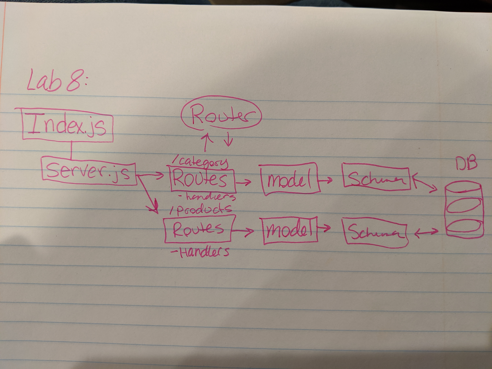

# Lab 08 

## Express Routing and Connected API

### Author: Natalie Alway

### Links and Resources
* [submission PR](https://github.com/nataliealway-401-advanced-javascript/lab-08-express-routing/pull/1)
* [travis](https://www.travis-ci.com/nataliealway-401-advanced-javascript/lab-08-express-routing)
* [Backend](https://lab-08-express-routing.herokuapp.com/)

#### Documentation
* [jsdoc](https://github.com/nataliealway-401-advanced-javascript/lab-08-express-routing/tree/workingBranch/docs)

### Setup
#### `.env` requirements
* `PORT` - 3000
* `MONGODB_URI` - `mongodv://localhost:27017/class-08`

#### Running the app
* `npm start`
* Endpoint: `/api/v1/categories`
  * Returns a JSON object category data in it.
* Endpoint: `/api/v1/products`
  * Returns a JSON object with product data in it.
  
#### Tests
* `npm test`

#### UML

